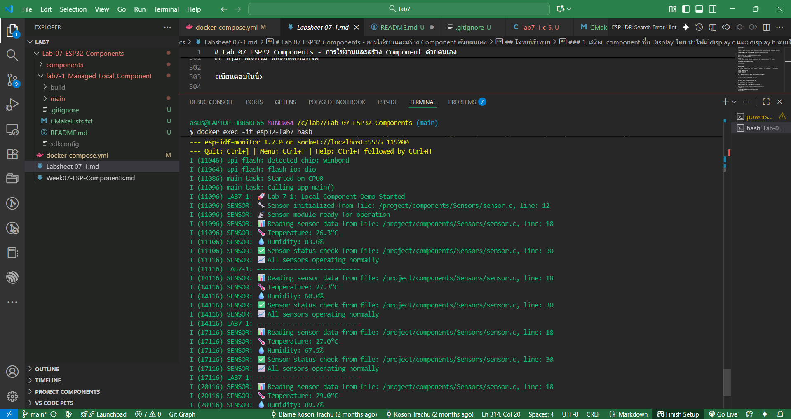
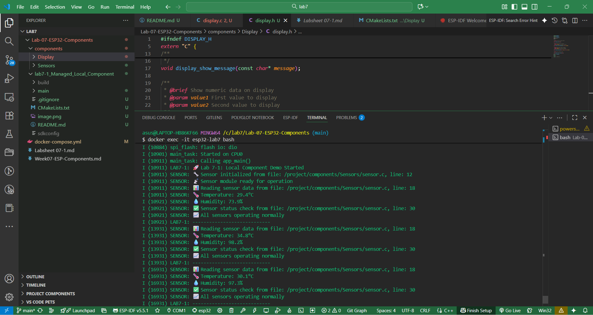

# Lab 7-1: Local Component Demo

## คำอธิบาย
การทดลองนี้แสดงการใช้งาน component ที่มีอยู่ในโฟลเดอร์ `components/Sensors/` ของ project

## สรุปคำสั่งที่ใช้ และผลลัพธ์ที่ได้

ใช้คำสั่ง idf.py qemu monitor จะแสดงผลดังภาพ

โจทย์ท้าทาย เมื่อนำโค้ดจากlab6มาและใช้คำสั่งเดิมจะได้ผลดังภาพ

## โจทย์ท้าทาย

### 1. สร้าง  component ชื่อ `Display` โดย นำไฟล์ `display.c` และ `display.h` จากใบงานที่ 6 มาใช้ 

สิ่งที่ต้องมีใน display component
1. ไฟล์ `CMakeLists.txt` 
2. ไฟล์ `display.h`
3. ไฟล์ `display.c`

### 2. นำโค้ดจาก main.c ในใบงานที่ 6 มาใช้ แล้ว build พร้อมทดสอบ
